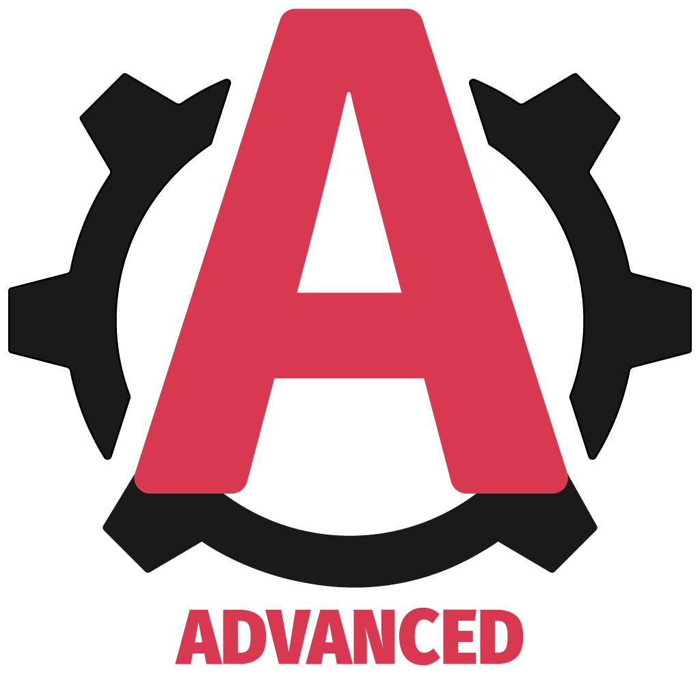

<div align="center" style="margin-bottom:30px">
    <a href='https://github.com/vagr9k/gatsby-advanced-starter/blob/master/LICENSE'>
    
    </a>
    <a href='https://github.com/vagr9k/gatsby-advanced-starter'>
    
    </a>
        <a href='https://github.com/vagr9k/gatsby-advanced-starter/stargazers'>
    
    </a>
        <a href="https://twitter.com/intent/tweet?text=A%20cool%20%40gatsbyjs%20starter%3A&url=https%3A%2F%2Fgithub.com%2FVagr9K%2Fgatsby-advanced-starter">
    
    </a>
</div>

<div align="center"  style="margin-bottom:30px">
    
</div>

<div align="center"  style="margin-bottom:30px">
<a href="https://www.npmjs.com/package/gatsby-theme-advanced"></a>

<a href='https://coveralls.io/github/Vagr9K/gatsby-advanced-starter?branch=master'></a>
</a>
</div>

# Gatsby Theme Advanced

[`gatsby-theme-advanced`](https://www.npmjs.com/package/gatsby-theme-advanced) is a theme for [GatsbyJS](https://github.com/gatsbyjs/gatsby/) which provides a minimal base for building advanced GatsbyJS powered websites by using the latest technologies.

It doesn't define any UI limitations in any way and only gives you the basic components for SEO, Links, infinite scrolling while creating a comfortable development environment to get started.

You are free to use any UI framework/styling options or you can use the [`gatsby-theme-amaranth`](https://www.npmjs.com/package/gatsby-theme-amaranth) as a starting point, which provides a blog design styled with [Styled Components](https://styled-components.com/)

## Previews

[Sample skeleton website demo](https://advanced-demo.netlify.app/)

[Fully designed blog demo preview](https://amaranth-demo.netlify.app/).

Visit [`gatsby-theme-amaranth`](https://github.com/Vagr9K/gatsby-advanced-starter/tree/master/themes/amaranth) for details regarding on how it was built using `gatsby-theme-advanced`.

## Features

- Gatsby v4 support
- First class TypeScript support (for query data and components exposed by the theme)
- Posts in MDX
  - Code syntax highlighting
  - Embed videos
  - Embed iframes
- Infinite Scrolling
- React Query for client side API calls
- Tags
  - Separate page for posts under each tag
- Categories
  - Separate page for posts under each category
- Related posts computation and display based on category/tag match ranking
- [Disqus](https://disqus.com/) support
- [gatsby-plugin-image](https://www.gatsbyjs.com/plugins/gatsby-plugin-image/) for optimized image generation
- Inline SVG imports
- High configurability
- Separate components for everything:
  - Gatsby Link utilities
  - SEO
  - Disqus
- [NetlifyCMS](https://www.netlifycms.org) support out of the box
- PWA features
  - Offline support
  - Web App Manifest support
  - Loading progress for slow networks
- SEO
  - [Google gtag.js](https://developers.google.com/gtagjs/) support
  - Sitemap generation
  - General description tags
  - [Google Structured Data](https://developers.google.com/search/docs/advanced/structured-data/intro-structured-data)
  - [OpenGraph Tags (Facebook/Google+/Pinterest)](https://ogp.me/)
  - [Twitter Tags (Twitter Cards)](https://developer.twitter.com/en/docs/tweets/optimize-with-cards/overview/markup)
- RSS feeds

## Usage

Install the theme via:

```sh
npm install gatsby-theme-advanced
```

or

```sh
yarn add gatsby-theme-advanced
```

Take a look at [`Gatsby Advanced Starter`](https://github.com/Vagr9K/gatsby-advanced-starter) which can help you to kickstart your development process.

To configure the theme, consult the [Configuration](#configuration) section.

Make sure you are familiar with [GatsbyJS](https://github.com/gatsbyjs/gatsby/) documentation for themes, in particular:

- [What Are Gatsby Themes?](https://www.gatsbyjs.com/docs/themes/what-are-gatsby-themes/)
- [Using a Gatsby Theme](https://www.gatsbyjs.com/docs/how-to/plugins-and-themes/using-a-gatsby-theme/)
- [Using Multiple Gatsby Themes](https://www.gatsbyjs.com/docs/themes/using-multiple-gatsby-themes/) for combining this theme with others
- [Shadowing in Gatsby Themes](https://www.gatsbyjs.com/docs/how-to/plugins-and-themes/shadowing/) for customizing this theme

## Configuration

To configure the theme edit your `gatsby-config.js`:

```js
module.exports = {
  plugins: [
    {
      resolve: `gatsby-theme-advanced`,
      options: {
        basePath: `/blog`,
      },
    },
  ],
};
```

Available options are:

```ts
const config: SiteConfig = {
  // Website configuration
  website: {
    title: "Gatsby Advanced Starter", // Homepage title
    titleShort: "Advanced Blog", // Short site title for homescreen (PWA). Preferably should be under 12 characters to prevent truncation
    name: "Gatsby Advanced Starter", // Website name used for homescreen (PWA) and SEO
    description: "A GatsbyJS starter equipped with advanced features.", // Website description used for RSS feeds/meta description tag
    language: "en", // Sets the global HTML lang attribute
    logoUrl: "/logos/logo-1024.png", // Logo used for SEO
    fbAppId: "1825356251115265", // FB Application ID for using app insights
    twitterName: "Vagr9K", // Twitter handle of the website
    url: "https://gatsby-advanced-starter-demo.netlify.com", // Domain of your website without the pathPrefix
    rss: "/rss.xml", // Path to the RSS file
    rssTitle: "Gatsby Advanced Starter RSS Feed", // Title of the RSS feed

    googleAnalyticsId: "UA-VALIDID", // GA tracking ID
    copyright: "© Copyright 2021 | Advanced User", // Copyright string for the footer of the website and RSS feed.

    themeColor: "#D83850", // Used for setting manifest and progress theme colors.
    backgroundColor: "#F7F7F7", // Used for setting manifest background color.
  },

  // User configuration
  user: {
    id: "AdvancedUser", // Unique identifier of the user on the website. Used for OpenGraph SEO tags
    firstName: "Advanced", // Used for SEO
    lastName: "User", // Used for SEO
    twitterName: "Vagr9K", // Twitter username used for SEO
    linkedIn: "your-linkedin", // Used for contact information
    github: "vagr9k", // Used for contact information
    email: "AdvancedUser@example.com", // Used for contact information and displayed in the RSS feed
    location: "User Location", // User location used for SEO
    about: "A full-stack web developer looking for a challenge!", // User information used for the author section
    avatar: "https://i.pravatar.cc/300", // User avatar used for the author section
  },

  // Organization information used for SEO
  organization: {
    name: "Organization Name",
    description: "Organization description",
    logoUrl: "/logos/logo-512.png",
    url: "https://gatsby-advanced-starter-demo.netlify.com", // URL of the organization website
  },

  // Gatsby Configuration
  pathPrefix: "/", // Prefixes all links. For cases when deployed to example.github.io/gatsby-advanced-starter/.

  contentDir: undefined, // Directory for MDX posts. Defaults to "content".
  assetDir: undefined, // Asset directory. Defaults to "static".

  embeddedImageWidth: 768, // MDX embedded image width. Used by gatsby-plugin-image for optimization
  embeddedVideoWidth: 920, // MDX embedded video width in pixels

  iconPath: undefined, // Icon used for manifest icon creation.
  iconList: [], // Icons used for the web manifest. Can be used to override iconPath for a more pixel perfect control.
  iconCachePaths: undefined, // Glob pattern path for the icons to be cached by the gatsby-plugin-offline

  basePath: undefined, // Base path for mounting pages. Allows for multiple themes to be used in a single website.
};
```

## Examples

### Advanced Demo

[Source Code](https://github.com/Vagr9K/gatsby-advanced-starter/tree/master/examples/advanced-demo)

[Live Preview](https://advanced-demo.netlify.app/)

The **Advanced Demo** is a skeleton blog website used to showcase the capabilities of the theme.
The demo also includes E2E tests used for verifying the theme functionality.

As an example of [component shadowing](https://www.gatsbyjs.com/docs/how-to/plugins-and-themes/shadowing/), you can take a look at how the [post and feed templates were implemented](https://github.com/Vagr9K/gatsby-advanced-starter/tree/master/examples/advanced-demo).

### Gatsby Theme Amaranth

[Source Code](https://github.com/Vagr9K/gatsby-advanced-starter/tree/master/themes/amaranth)

[Live Preview](https://amaranth-demo.netlify.app/)

The **Gatsby Theme Amaranth** is a stylish blog website which uses `styled-components` for styling.

As an example of [component shadowing](https://www.gatsbyjs.com/docs/how-to/plugins-and-themes/shadowing/), you can take a look at how the [post and feed templates were implemented](https://github.com/Vagr9K/gatsby-advanced-starter/tree/master/themes/amaranth/src/gatsby-theme-advanced/templates).

# Author

Ruben Harutyunyan ([@Vagr9K](https://twitter.com/Vagr9K))
